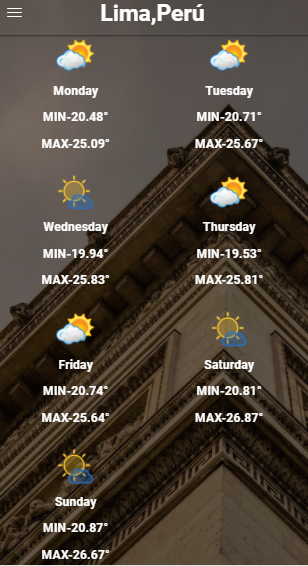

# WEATHER

* **Track:** _Common Core_
* **Curso:** _CONSTRUYE UNA SINGLE PAGE APP (SPA) MULTI-USUARIO CONSUMIENDO DATA REMOTA_
* **Unidad:** _A JUGAR CON WEB APIS _

***

¿Has visto que los sistemas operativos móviles vienen con una APP de predicción del clima? ¡Vamos a hacer la nuestra! Para ello, usaremos la API de Dark Sky y esperemos llegues a usar un API de imágenes como Flickr, Unsplash u otro. A continuación te dejamos unos slides con algunos recursos y guías del flujo de la app. Recuerda que no es necesario que sigas el diseño al pie de la letra, eres completamente libre de adaptarlo a tus gustos.

El presente reto pone a prueba nuestros conocimientos sobre **APIS**.

## Objetivo

- Se nos pide pedir la localizacion para obtener los datos del clima del día y lugar actual,

- Al darle click en predicciones del clima pasa a la siguiente pagina.

- La imagen de fondo mostrada es random y es  obtenida del Api unsplash

- Debera mostrar los datos de los proximos 7 días obtenidos desde el Api de dark Sky

## Detalles adicionales

* Dentro del repositorio encontrarás un archivo index.html el cual contiene la estructura sobre la que se realizó el reto.
* En la carpeta css un archivo main.css donde está todos los estilos aplicados y el grid que se creó para este reto. Los cuales están enlazados con mi HTML.
* En assets también se encuentra la carpeta images donde se encuentran todos las imágenes usadas para completar este reto.
* Por último el README.md explicando el contenido de mi repositorio.
* Dentro de la rama **gh-pages** un link donde se podrá visualizar el resultado final.

## Autor

* Gabriela Mamani Flores.
* Jennifer Carmen Sosa.